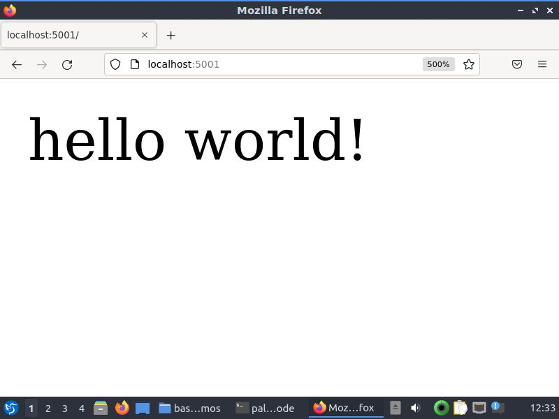

# docker-flask

A simple "Hello World" application on Flask and Docker.

## Prerequisites

* You should have Docker installed in your computer. Download Docker from [here](https://docs.docker.com/get-docker/)
* If running on Linux, make sure you follow [these steps](https://docs.docker.com/engine/install/linux-postinstall/) to run docker in **rootless** mode.

> You don't need Python 3, pip or flask installed on your computer. All of these are containerised into the Docker image!

## Steps to run

* Clone this repository
* Build the docker image : `docker image build -t python-hello-world .`
* Run the docker image : `docker run -p 5001:5000 -d python-hello-world`
* Browse to [localhost:5001](http://localhost:5001) on your preferred web browser. You'll be greeted with "Hello World"!

> Go ahead and build Flask applications using this Docker image! Good Luck :)
