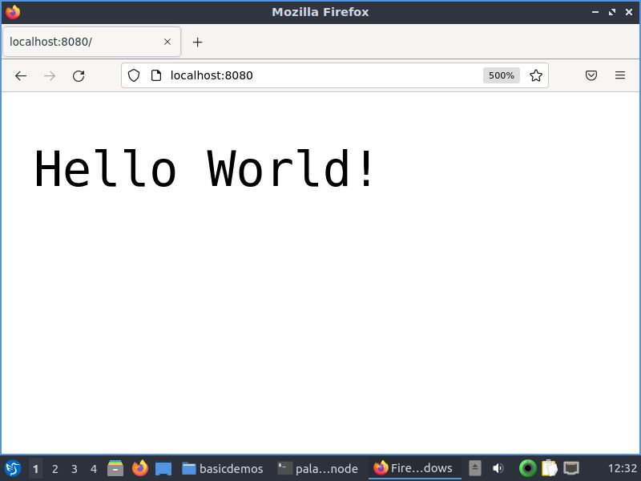

# docker-node

A simple HTTP module based "Hello World" Node.js application on Docker, because sometimes all you need to do is show a containerised Node.js app for your college practicals lol.

## Prerequisites

* You should have Docker installed in your computer. Download Docker from [here](https://docs.docker.com/get-docker/)
* If running on Linux, make sure you follow [these steps](https://docs.docker.com/engine/install/linux-postinstall/) to run docker in **rootless** mode.

> You don't need Node.js or NPM installed on your computer. All of these are containerised into the Docker image!

## Steps to run

* Clone this repository
* Build the docker image : `docker image build -t node-hello-world .`
* Run the docker image : `docker run -p 8080:8080 -d node-hello-world`
* Browse to [localhost:8080](http://localhost:8080) on your preferred web browser. You'll be greeted with "Hello World"!

> Go ahead and build Node.js applications using this Docker image! Good Luck :)
