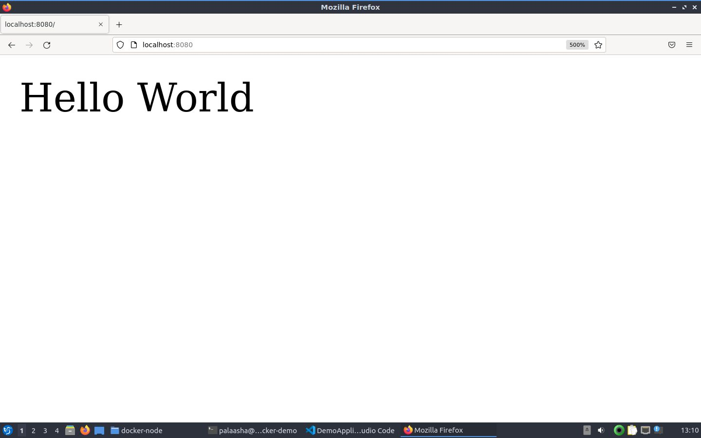

# docker-spring

A simple "Hello World" application made in Spring Boot, containerised on Docker.

## Prerequisites

* You should have Docker installed in your computer. Download Docker from [here](https://docs.docker.com/get-docker/)
* If running on Linux, make sure you follow [these steps](https://docs.docker.com/engine/install/linux-postinstall/) to run docker in **rootless** mode.

## Steps to run

* Clone this repository
* Build the docker image : `docker image build -t docker-spring .`
* Run the docker image : `docker run -p 8080:8080 docker-spring`
* Browse to [localhost:8080](http://localhost:8080) on your preferred web browser. You'll be greeted with "Hello World"!
